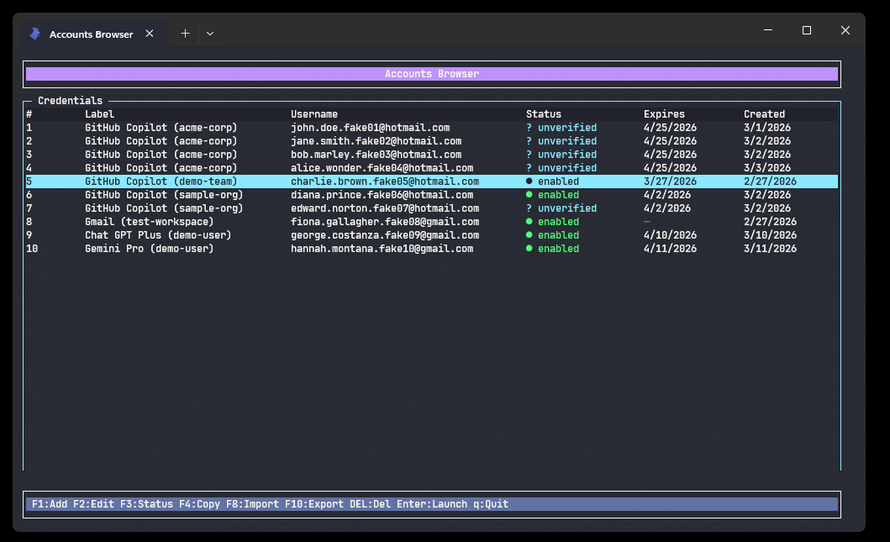
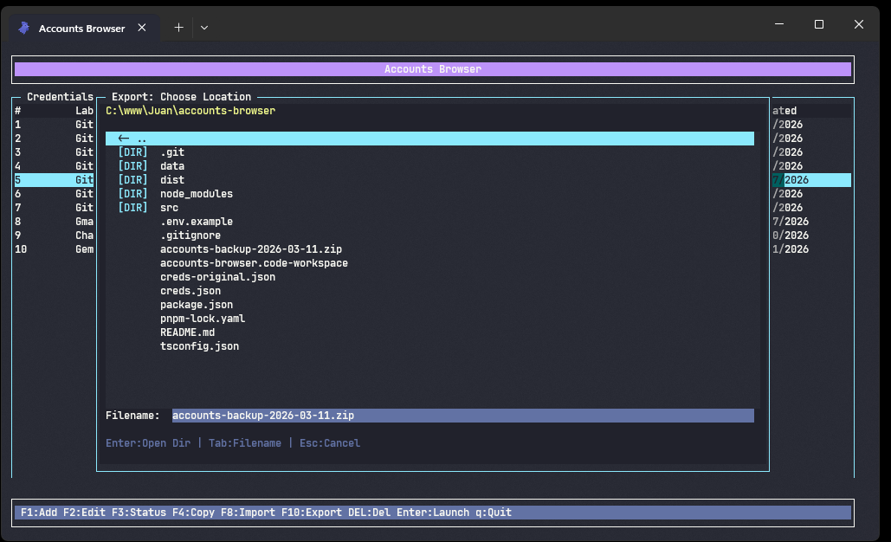
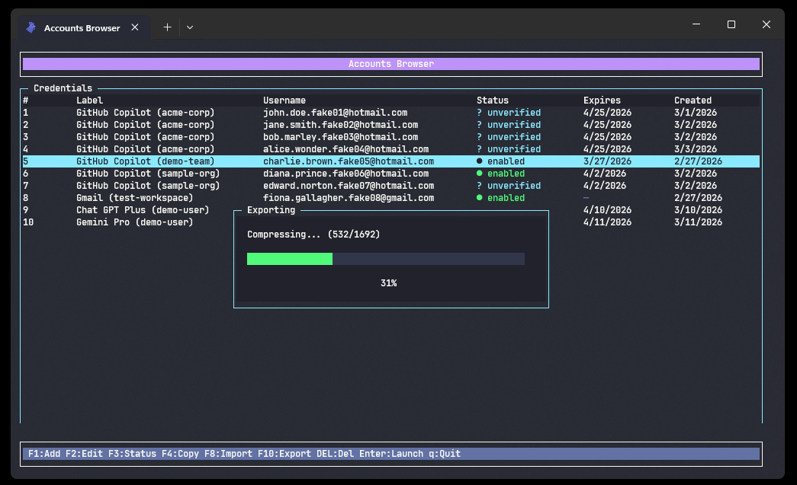

<p align="center">
  
</p>

<h1 align="center">🌐 Accounts Browser</h1>

<p align="center">
  <b>A blazing-fast TUI credential manager with isolated Puppeteer browser profiles.</b><br/>
  Manage dozens of accounts, launch browsers with unique fingerprints, export/import backups — all from your terminal.
</p>

<p align="center">
  
  
  
  
</p>

---

## ✨ Features

- 🔑 **Full CRUD** — Add, edit, delete and change credential statuses
- 🚀 **One-click browser launch** — Each account gets its own isolated Chrome profile (cookies, cache, sessions)
- 🎨 **Rich TUI** — Color-coded statuses, expired dates in red, running browser indicators
- 📋 **Clipboard copy** — Username, password or both with a single shortcut
- 📦 **Backup & Restore** — Export everything to `.zip` and import on another machine
- 🗂️ **Built-in file browser** — Navigate your filesystem directly in the TUI to choose files
- ⚡ **Cross-platform binary** — Compile to a single executable via Bun.js

---

## 📸 Previews

### Dashboard

The main screen shows all credentials in a table with status icons, expiration dates and running browser indicators.

<p align="center">
  
</p>

### Export — File Browser

Built-in file browser dialog lets you choose where to save the backup `.zip`.

<p align="center">
  
</p>

### Export — Progress

Real-time progress bar with file count while compressing credentials and browser profiles.

<p align="center">
  
</p>

---

## 🎯 Use Cases

### 🏢 Google Ads Account Management

Manage multiple Google Ads accounts for agencies. Each account gets its own browser profile with unique cookies and sessions — no cross-contamination between clients.

### 🎁 Free-tier Account Farming

Organize free-tier accounts (Copilot, Gemini, ChatGPT trials). Track expiration dates, rotate between accounts, and keep all sessions alive with isolated profiles.

### 💼 Account Reselling & Inventory

Keep an organized inventory of purchased accounts. Export/import backups to transfer entire portfolios between machines. Status tracking (`unverified` → `enabled` → `expired`) gives clear visibility on what's ready.

### 🔄 Multi-platform Session Isolation

Run multiple logins at the same time on the same service. Each credential launches a truly isolated browser — different cookies, different fingerprint, different everything.

---

## 🚀 Quick Start

### Requirements

| Tool        | Version | Required                             |
| ----------- | ------- | ------------------------------------ |
| **Node.js** | >= 18   | ✅ Yes                               |
| **pnpm**    | >= 8    | ✅ Yes                               |
| **Bun**     | >= 1.0  | ⬜ Optional (for binary compilation) |

### Install & Run

```bash
# 1. Install dependencies
pnpm install

# 2. Run in development mode
pnpm dev
```

That's it. The app creates `creds.json` and `data/` automatically on first use.

### Environment Configuration (optional)

```bash
cp .env.example .env
```

| Variable     | Default        | Description                        |
| ------------ | -------------- | ---------------------------------- |
| `CREDS_PATH` | `./creds.json` | Path to the credentials JSON file  |
| `DATA_DIR`   | `./data`       | Directory for browser profile data |

---

## ⌨️ Keyboard Shortcuts

| Key                 | Action                                            |
| ------------------- | ------------------------------------------------- |
| `↑` `↓`             | Navigate credentials list                         |
| `Enter`             | 🚀 Launch isolated browser for selected account   |
| `F1`                | ➕ Add new credential                             |
| `F2`                | ✏️ Edit selected credential                       |
| `F3`                | 🔄 Change status                                  |
| `F4`                | 📋 Copy to clipboard (username / password / both) |
| `F8`                | 📥 Import backup from `.zip`                      |
| `F10`               | 📦 Export credentials + data to `.zip`            |
| `DEL`               | ❌ Delete credential (with confirmation)          |
| `Tab` / `Shift+Tab` | Navigate form fields                              |
| `q`                 | 🚪 Quit                                           |

### Form Navigation

Inside credential forms (Add/Edit), fields cycle with **Tab** and **Shift+Tab**. Pressing **Enter** advances to the next field, and on the last field it submits.

Date fields accept **MM/DD/YYYY** format. Leave empty to skip.

---

## 🏷️ Credential Statuses

| Icon | Status       | Description                    | Can Launch? |
| ---- | ------------ | ------------------------------ | ----------- |
| `?`  | `unverified` | Newly added, not yet confirmed | ✅ Yes      |
| `●`  | `enabled`    | Active and ready to use        | ✅ Yes      |
| `○`  | `disabled`   | Temporarily disabled           | ❌ No       |
| `◌`  | `expired`    | Past expiration date           | ❌ No       |
| `✗`  | `error`      | Has an issue                   | ❌ No       |

New credentials start as **unverified** by default.

---

## 📦 Backup Format

The `.zip` created by **F10** has a standard portable structure:

```
accounts-backup-2026-03-11.zip
├── creds.json              ← All credentials (JSON)
└── data/                   ← Browser profiles
    ├── <credential-id-1>/  ← Cookies, cache, local storage
    ├── <credential-id-2>/
    └── ...
```

**Import (F8)** reads this exact structure and overwrites the current data. The backup is fully portable — export on Windows, import on Linux, and everything works.

---

## 🔨 Building a Binary with Bun

Bun compiles TypeScript directly into a single native executable — no Node.js required on the target machine.

### Local Build

```bash
# Compile for the current platform
pnpm bun:build
```

Output: `accounts-browser` (Linux/macOS) or `accounts-browser.exe` (Windows).

### Cross-compilation Pipeline

Build for all platforms from a single machine:

```bash
# Linux x64
bun build src/index.ts --compile --target=bun-linux-x64 --outfile dist/accounts-browser-linux-amd64

# Linux ARM64
bun build src/index.ts --compile --target=bun-linux-arm64 --outfile dist/accounts-browser-linux-arm64

# Windows x64
bun build src/index.ts --compile --target=bun-windows-x64 --outfile dist/accounts-browser-win32-amd64.exe

# Windows ARM64
bun build src/index.ts --compile --target=bun-windows-arm64 --outfile dist/accounts-browser-win32-arm64.exe
```

> ⚠️ **Note:** Puppeteer requires a Chromium installation at runtime. After deploying the binary, run `npx puppeteer browsers install chrome` on the target machine.

---

## 🤖 CI/CD — GitHub Actions

The project includes a GitHub Actions workflow that automatically builds binaries for **4 platforms** on every tag push.

### How to trigger a release

```bash
git tag v1.0.0
git push origin v1.0.0
```

This runs `.github/workflows/build.yml` which:

1. Installs Bun and dependencies
2. Cross-compiles for `linux-amd64`, `linux-arm64`, `win32-amd64`, `win32-arm64`
3. Uploads all binaries as a GitHub Release

### Supported Platforms

| Platform      | Target              | Output                             |
| ------------- | ------------------- | ---------------------------------- |
| Linux x64     | `bun-linux-x64`     | `accounts-browser-linux-amd64`     |
| Linux ARM64   | `bun-linux-arm64`   | `accounts-browser-linux-arm64`     |
| Windows x64   | `bun-windows-x64`   | `accounts-browser-win32-amd64.exe` |
| Windows ARM64 | `bun-windows-arm64` | `accounts-browser-win32-arm64.exe` |

---

## 💾 Data Storage

| What             | Location                | Configurable        |
| ---------------- | ----------------------- | ------------------- |
| Credentials      | `creds.json`            | ✅ via `CREDS_PATH` |
| Browser profiles | `data/<credential-id>/` | ✅ via `DATA_DIR`   |

Each credential gets its own isolated browser context — like separate Chrome profiles. Cookies, local storage, and cache are all sandboxed per account.

---

## 📁 Project Structure

```
accounts-browser/
├── .github/
│   └── workflows/
│       └── build.yml         GitHub Actions cross-platform build
├── src/
│   ├── index.ts              Entry point
│   ├── types.ts              Type definitions & status constants
│   ├── config.ts             Environment configuration loader
│   ├── credentials.ts        Credential CRUD store (JSON)
│   ├── browser.ts            Puppeteer launcher with CDP viewport
│   ├── tui/
│   │   └── App.ts            Terminal UI (blessed) — all screens
│   └── assets/
│       └── *.png             Preview screenshots
├── data/                     Browser profiles (auto-created)
├── creds.json                Credentials file (auto-created)
├── .env.example              Environment config template
├── tsconfig.json
├── package.json
└── README.md
```

---

<p align="center">
  Made with ☕ and <code>blessed</code>
</p>
